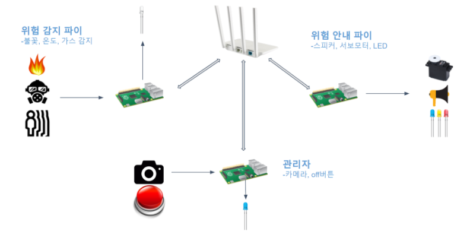

# System Programming Team3 Project

## Smart Safety System
본 프로젝트는 시스템 프로젝트 강의용이다

# 프로젝트 목표
라즈베리파이를 활용하여 가스, 화재를 감지한 후 이를 스피커와 LED를 통해 어떠한 위급 상황인지를 사용자들에게 알려주고 건물 내 비상문의 도어락을 모두 개방하는 스마트 안전 시스템(SSS)를 고안하였다.

# 파이 의미
- 위험감지파이
    - 가스, 불꽃 센서를 통해 위험을 감지하는 위험 감지 파이
- 위험안내파이
    - 스피커, 서보모터, LED를 통해 위험을 안내
- 관리자파이
    - 버튼을 통해 시스템을 통제하며 감지 위험 현장에서 사람이 있다고 판단할 경우 이를 카메라로 촬영하여 화면을 통해 보여줌

# 팀원 소개
- 아주대 소프트웨어학과 201720779 김강현
    - 감지파이 담당
- 아주대 소프트웨어학과 201820770 문민수
    - 안내파이 담당
- 아주대 소프트웨어학과 201823779 신현석
    - 관리자파이 담당
 
# 실행 방법
1. 각 파이에서 make를 해준다
2. 감지파이
```
./detect {port for 안내파이}{port for 관리자파이}
```
3. 관리자파이
```
./manager 192.168.0.5 {port for 감지파이} {port for 안내파이}
```
4. 안내파이
```

```

# 응용시스템 구조


# ref

